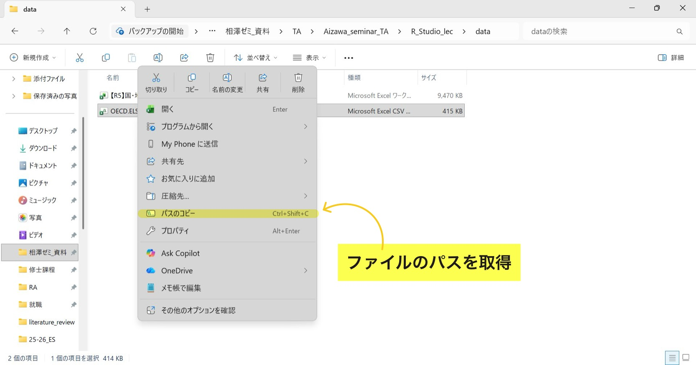

```{r}
#| include: false
pacman::p_load(tidyverse, readxl)
```

## はじめに

前回[(1) Rの基本操作①：超基本操作・パッケージ](https://ochunchun.github.io/Aizawa_seminar_TA/R_Studio_lec/R_Studio_lec(1)/R_Studio_lec(1).html)では、R Studioを用いた基本的な演算・代入操作などに加えて、Rで必要不可欠なパッケージの利用方法を解説した。

本章では、前回同様にRに関する基本操作を説明するが、焦点はデータフレームに集中する。

## データフレームとは？

**データフレーム**はデータ分析において最もよく用いられるデータ構造であり、私たちが一般的に考える以下の様な表のことを表す。

|都道府県|人口   |県庁所在地|面積$(km^2)$|県内総生産（100万円）|
|--------|------:|---------:|-----------:|--------------------:|
|北海道  |5043000|札幌市    |83457       |20889250             |
|青森県  |1165000|青森市    |9645        |4439055              |
|岩手県  |1145000|盛岡市    |15279       |4797050              |
|宮城県  |2248000|仙台市    |6862        |9614668              |
|秋田県  |897000 |秋田市    |11636       |3629335              |
|山形県  |1011000|山形市    |6652        |4340427              |
|福島県  |1743000|福島市    |13783       |7864963              |

基本的に縦軸（行）が1つ1つの観測（北海道, 青森県, etc.）を表し、横軸（列）が変数（人口, 面積, etc.）を表す構造になっている。

皆さんが卒業研究などで分析を行なう際、ほとんどの学生は[政府統計(E-Stat)](https://www.e-stat.go.jp/){target="_blank"}や[世界銀行データベース](https://data.worldbank.org/){target="_blank"}といった公的サイトからデータフレーム（excelファイルやcsvファイル）をダウンロードし、それらをRに読み込んで分析を行なう。

## データフレームの読み込み

ここではデータフレームを**Rに読み込む方法**を紹介する。

### データフレームの検索・保存

先ず大前提として、<u>自身の研究テーマに沿ったデータフレームを探して、任意のファイルに保存すること</u>から始める。[^1]

[^1]: 私の場合、卒業論文では宿泊税と外国人旅行者の宿泊日数の関係性を研究するため、東京都の[国・地域別外国人旅行者行動特性調査](https://www.sangyo-rodo.metro.tokyo.lg.jp/data/tourism/tourism){target="_blank"}のデータをWebサイトからダウンロードして分析した。

:::{.callout-note collapse="true"}
## 研究テーマの選び方（ミクロデータ・マクロデータ）

卒業論文の研究テーマ探しは非常に難しい問題であり、学部4年の上半期にある程度決まる学生もいれば、卒論提出2ヶ月前ぐらいで決まる学生もいる。計量経済学などのデータ分析を用いて卒業論文を書く場合、注意すべきなのは**データが存在するかどうか？**である。

計量経済学（特にミクロ計量経済学）では、1つ1つの家計・個人の収入や健康状態といった**ミクロデータ**を分析に用いることが多々ある。しかしながら、そのようなデータは重大な個人情報を含んでおり、学部生の卒業研究では扱うことが出来ないものも存在する。公的なWebサイトで一般公開されているものは、1つの国・地域ごとの生産額や人口といった**マクロデータ**がほとんどであろう。

皆さんが卒業論文でデータ分析を用いる場合は、**そのテーマを分析できるデータが存在するか？**、**存在した場合、そのデータは利用可能かどうか？**を考慮に入れながら、テーマを絞っていくことをオススメする。
:::


### ファイルのパス取得

Webサイトでデータを何らかのファイルに保存し、Rで呼び出すとき、**ファイルのパス**
と言うものが必要になる。これはそのデータがパソコン内のどこにあるかを示す住所のようなもので、`"C:/Users/narita yoshiyuki/Desktop/相澤ゼミ_資料/TA/..."`のような形になっている。

パスの取得方法は簡単で、ファイル→対象のデータを右クリック→パスのコピーで取得可能だ。

{width="70%"}

### ファイルを読み込む関数

Rにデータフレームを読み込む場合、`オブジェクト <- 関数(ファイルのパス, ファイルの文字コード指定)`で、任意のオブジェクトにデータフレームを代入する必要がある。ここではその際に用いられる関数について、以下の2つのファイル形式における読み込み方法を紹介する。

- csvファイルの読み込み：`readr::read_csv()`
- excelファイル（拡張子が.xls または.xlsx）の読み込み：`readxl::read_excel()`
  
#### csvファイルの読み込み：`readr::read_csv()`

csvファイルを読み込む際に用いる関数として、`read_csv()`が度々用いられる。{readr}パッケージに含まれる関数であり、他の読み込み関数に比べて高速で機能性が高い。[^2]

[^2]: 他のcsvファイル用の関数として、Rに内蔵されている`read.csv()`関数が挙げられる。時間があれば生成AIなどで`readr::read_csv()`との違いを調べてみるのもありだろう。

ここでは読み込みの例といて、[政府統計(e-Stat)](https://www.e-stat.go.jp/){target="_blank"}上にある、「犯罪統計」からのデータを利用する（本データは[ここをクリック](https://github.com/ochunchun/Aizawa_seminar_TA/tree/main/R_Studio_lec/data){target="_blank"}にある`crime_statistics.csv`から取得可能）。

```{r}
#| eval: false
# readrパッケージのインストール・読み込み
install.packages("readr")
library(readr)
```

```{r}
# データフレームの読み込み(crimeというオブジェクトに代入する)
crime <- read_csv(
  # ファイルのパス
  "C:/Users/narita yoshiyuki/Desktop/相澤ゼミ_資料/TA/Aizawa_seminar_TA/R_Studio_lec/data/crime_statistics.csv",
  # 文字コードの指定
  locale = locale(encoding = "CP932"))

# データフレームを軽く表示してみる
crime
```

上記の様にコードを書いて実行すると、画面右上(Environment)の部分に`crime`という代入されたデータフレームが表示されるはずだ。これでcsvファイルの読み込みは完了である。

:::{.callout-note collapse="true"}
## 文字コードの指定

**文字コード**とは、パソコン上で文字を扱うために、文字に対して割り当てられた数値のことであり、様々な種類が存在する(UTF-8, Shift_JIS, CP932, ...)。Rにデータフレームを読み込む際、各ファイルの文字コードを適切に指定しなければ、コンピュータが文字を読み取れずにエラーが出てしまう。

そのため、Rにcsvファイルを読み込む際は、上記の様に`locale = locale(encoding = "文字コード")`で指定する必要がある。また、Webサイトからcsvファイルを保存する時に、文字コードを指定できる場合があるため、その際はUTF-8を選択することをオススメする。[^3]

[^3]: `read_csv()`はデフォルトの文字コード設定がUTF-8であるため、UTF-8のcsvファイルは`locale = locale(encodeing = "UTF-8")`を書かなくて良い。
:::

#### excelファイルの読み込み：`readxl::read_excel()`

excelファイルの読み込みは{readxl}パッケージの`read_excel()`を用いて行なう。ここでは[令和5年東京都 国・地域別外国人旅行者行動特性調査](https://www.sangyo-rodo.metro.tokyo.lg.jp/data/tourism/tourism/r5){target="_blank"}のexcelデータを読み込む（本データは[ここをクリック](https://github.com/ochunchun/Aizawa_seminar_TA/tree/main/R_Studio_lec/data){target="_blank"}にある`【R5】国・地域別外国人旅行者行動特性調査.xlsx`より取得可能）。

```{r}
#| eval: false
# readxlパッケージのインストール・読み込み
install.packages("readxl")
library(readxl)
```

```{r}
#| cache: true
Tokyo_r5 <- read_excel(
  # ファイルのパス
  "C:/Users/narita yoshiyuki/Desktop/相澤ゼミ_資料/TA/Aizawa_seminar_TA/R_Studio_lec/data/【R5】国・地域別外国人旅行者行動特性調査.xlsx")

# データフレームを軽く表示してみる
Tokyo_r5
```

`read_csv()`と異なり、`read_excel()`では文字コードを指定する必要がない。先ほどと同様に、画面右上(Environment)の部分に`Tokyo_r5`と表紙されていれば、excelファイルの読み込みも完了である。

## データフレームの基本的な取り扱い

ここからは読み込んだデータフレーム`Tokyo_r5`を用いて、基本的な操作方法を何点か列挙していく。

### R Studioの画面上における操作

:::{.panel-tabset}
## R Studioの画面(1)

ここまで記載されたRコードが上手く実行出来ている場合、R Studioの画面上部(R ScriptとEnvironment)は以下の画像に様になっているはずだ。読み込まれたデータフレームをexcelのように視覚的に確認したい場合、画面の[□]{style="color:red;"}部分をクリックすれば良い（`crime`データを見たければ`crime`の部分を、`Tokyo_r5`データが見たければ`Tokyo_r5`の部分をクリック）。

.jpg){width="85%"}

## R Studioの画面(2)

前述の部分をクリックすると、以下の様に、画面左上のR Scriptがあった部分にデータが視覚的に表示される。あとの補足的な操作は下画面の内容を参照されたい。

.jpg){width="85%"}
:::


### データの抽出

データフレーム内から特定の行・列を**抽出する**場合`データフレーム[行番号, 列番号]`を用いる。複数の行・列を抜き出す場合`データフレーム[c(行番号1, 行番号2, ...), c(列番号1, 列番号2, ...)]`のように、ベクトルと組み合わせれば良い。

```{r}
# Tokyo_r5のデータの5行目・8列目(都内泊数)を抽出する
Tokyo_r5[5, 8]

# 1,5,7行目・3,5,6列目(居住地, 年齢, 入国空港)を抽出する
Tokyo_r5[c(1, 5, 7), c(3, 5, 6)]
```

この操作はデータフレームに関わらず、行列(matrix)やベクトル(vector)のデータ構造においても有効である。

データ分析の際は、どちらかというと<u>特定の列（変数）だけを含めたデータセットが欲しい</u>場合が多い。そのような時は以下の方法が使える。

```{r}
# [行番号, 列番号]の行番号を指定しない(空白)
Tokyo_r5[ , c("居住地", "都内泊数", "年齢")] # 列番号の部分に変数名を指定してもOK
```

正直なところ、私は上記の方法でデータの抽出を行なっておらず、{dplyr}というパッケージに含まれる`select()`や`filter()`といった関数を主に用いる。あくまで上記の説明は、基本操作の1つを教えるという教育目的であり、より簡単かつ詳細に行・列の抽出を行なう関数が存在することを明記しておく（それらの関数の説明は coming later !）。[^4]

[^4]: `select()`, `filter()`などといった、行・列の抽出に関するより有益な教材として、[私たちのR 13 データハンドリング[抽出]](https://www.jaysong.net/RBook/datahandling1.html){target="_blank"}を参照されたい。


### 変数名の改名

Rでデータ分析をする際に推奨されるのが、**変数名を全て半角英数表記にすること**である。いちいち半角から変更するのは煩わしく、加えてエラーの原因にもなりやすい全角表記は、Rでの作業において極力避けた方が良いだろう。変数名を変更する時によく用いられるのは、{dplyr}パッケージに含まれる`rename()`という関数である。

```{r}
#| eval: false
# rename()関数の使い方
dplyr::rename(データフレーム名,
              新しい変数名1 = 現在の変数名1,
              新しい変数名2 = 現在の変数名2,
              ...)
```

早速、`Tokyo_r5`のデータにおける`"調査日"`と`"国籍"`の変数名を、`"date"`と`"nationality"`に変更してみる。

```{r}
#| eval: false
# dplyrパッケージのインストール・読み込み
install.packages("dplyr")
library(dplyr)
```

```{r}
# 変数名の変更
rename(Tokyo_r5,
       "date"        = "調査日",
       "nationality" = "国籍")
```

調査日、国籍であった2つの変数名が、ちゃんとdate、nationalityに変更されている。

### 新たな変数の追加・既存の変数の編集

読み込んだデータフレームに**新しい変数（列）を追加したい**場合や、**既存の変数を編集したい**場合が常々ある。その際に利用できる伝統的な方法として、`データフレーム名$追加(or編集)する変数名 <- 変数の定義や計算式`という書き方がある。`データフレーム名$変数名`の形は、特定の変数を指定する際に使われる書き方であるため、覚えておいて損はない。

以下では例として、`都内泊数`の各値からマイナス1した`都内泊数2`を作成してみる。

```{r}
# 都内泊数2の作成
Tokyo_r5$都内泊数2 <- Tokyo_r5$都内泊数 - 1

# 都内泊数と都内泊数2を表示してみる
Tokyo_r5[ , c("都内泊数", "都内泊数2")]
```

先ほど説明した行・列の抽出方法と同様に、変数の追加・編集においても上記の方法より有用なものが存在する。それは`dplyr::mutate()`という関数であり、複数の変数を同時に追加・編集することが出来る（これもcoming later !）。[^5]

[^5]: `mutate()`関数の使い方については、[私たちのR 15 データハンドリング[拡張]](https://www.jaysong.net/RBook/datahandling3.html){target="_blank"}を参照。
