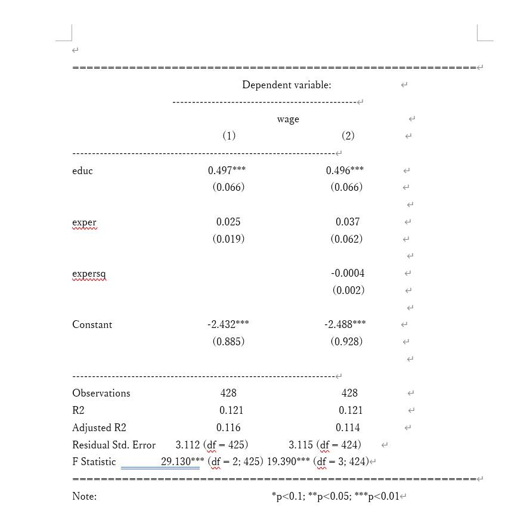

本章では、[R Studioで計量経済分析(1)](https://ochunchun.github.io/Aizawa_seminar_TA/R_Studio_lec/R_Studio_lec(1)/R_Studio_lec(1).html)で紹介した、OLS回帰分析について、見やすい結果の出力・追加の分析方法をより詳細に説明する。

## 分析結果の出力

[R Studioで計量経済分析(1)](https://ochunchun.github.io/Aizawa_seminar_TA/R_Studio_lec/R_Studio_lec(1)/R_Studio_lec(1).html)では`summary()`関数を用いて結果を出力したが、あまり見やすいものではなかった。

ここでは`summary()`以外で、結果を見やすく出力する関数について紹介する。

### 事前準備

この節での本題は**結果の出力**であるため、先にOLS回帰分析を済ませてしまおう。

今回はパッケージ{wooldridge}のmrozというデータから、以下2つのミンサー型賃金関数を推定する。

$$
\begin{align}
wage_{i} &= \beta_{0} + \beta_{1}educ_{i} + \beta_{2}exper_{i} + u_{i} \tag{1}\\
wage_{i} &= \beta_{0} + \beta_{1}educ_{i}  + \beta_{2}exper_{i} + \beta_{3}exper_{i}^2 + u_{i} \tag{2}
\end{align}
$$

$i$は各標本個体を示しており、$u_{i}$は誤差項である。
各変数について、$wage_{i}$ (時間当たり賃金), $educ_{i}$ (教育年数), $exper_{i}$ (労働市場での経験年数)を示している。(1)と異なり、(2)の賃金関数には$exper_{i}$の2乗項を含めた。

```{r}
#| cache: true
#| label: wooldridge
# wooldridgeを読み込む
library(wooldridge)
```

```{r}
#| cache: true
#| dependson: "wooldridge"
#| label: mincer

# OLS回帰分析を実行し、mincer_1, mincer_2に代入する
mincer_1 <- lm(wage ~ educ + exper, data = mroz)
mincer_2 <- lm(wage ~ educ + exper + expersq, data = mroz)

# 結果を簡単に出力
mincer_1
mincer_2
```

### stargazer

始めに紹介するのは`stargazer()`という関数である。パッケージ{stargazer}に含まれており、非常に見やすい分析結果を出力してくれる。なにより、複数の回帰分析結果を表示できることが`summary()`とは明確に異なっている。

```{r}
#| eval: false
stargazer(回帰モデル(複数個OK), type = 出力設定, ...)
```

回帰モデル(mincer_1など)は必ず示さなければいけない。後ろの`type = `について、詳細は後で話すが今回は`type = "text"`と入力する。

早速`stargazer()`で先ほどの分析結果を出力してみよう。

```{r}
#| eval: false
# stargazerのインストール
install.packages("stargazer")
```

```{r}
#| cache: true
#| dependson: "mincer"
# stargazerの読み込み
library(stargazer)

# 先ほどのmincer_1, mincer_2をstargazerで出力する
stargazer(mincer_1, mincer_2, type = "text")
```

`summary()`と比較して、かなり見やすくなった(と思う)。

表の中身について何点か説明しておく。

- 各説明変数(`educ`, `exper`, `expersq`, `Constant`)の右側にある値が推定された係数値を示している。[^1]
- 推定された係数値の下に括弧で囲まれた値があるが、これは<u>標準誤差</u>を示している。
- 表の下側に関して、標本の観測数`Observation`や決定係数`R2`が示されている。(それぞれの役割・意味については各自で勉強して欲しい。)
- `summary()`の時と＊の表し方が若干異なっている。
   - `summary()`: ＊で5%。＊＊で1%、＊＊＊で0.1%水準で統計的に有意
   - `stargazer()`: ＊10%、＊＊で5%、＊＊＊で1%水準で統計的に有意[^2]

[^1]: 切片の推定値$\beta_{0}$は一般的に`Intercept`や`Constant`の行に示されている。

[^2]: こっちの方が一般的

先ほど説明を割愛した`type =`について、この引数は表の出力方法を示すものである。`type = "text"`はそのままテキストとして出力する設定で、他のタイプとして`"latex"` (LaTeXという文書作成ソフトで出力するための設定)、`"html"` (HTMLで出力するための設定)が存在する。[^3]

[^3]: デフォルトは`type = "latex"`

### modelsummary

続いて紹介するのは`modelsummary()`という関数である。{modelsummary}パッケージに含まれており、ChatGPT曰く`modelsummary()`>>>`stagazer()`らしいので、大学院進学などを踏まえている学生にとっては、こちらの方が望ましい関数だと考えられる。

```{r}
#| eval: false
modelsummary(models = list(回帰モデル1, 回帰モデル2, ...), ...)
```

ここでも同様に、回帰モデルを示すことが最低限必要である。
`stargazer()`もそうだが、`modelsummary()`においては`models = `の他に大量の詳細オプションが存在するため、適宜確認することが望ましい。[^4]

[^4]:`?modelsummary`のように、確認したい関数の前に`?`を付けることで、R Studioの右下に存在するhelpが詳細を教えてくれる。

早速`modelsummary()`を用いて結果を表示してみよう！！

```{r}
#| eval: false
# modelsummaryのインストール
install.packages("modelsummary")
```

```{r}
#| cache: true
#| dependson: "mincer"
# modelsummaryの読み込み
library(modelsummary)

# 結果の出力
modelsummary(
  models = list(mincer_1, mincer_2),
  stars = c('*' = .1, '**' = .05, '***' = .01), # ＊の基準を設定して表示する
  fmt = 4, # 結果の小数点をどこまで記述するかを指定
  gof_omit = 'RMSE|AIC|BIC|Log.Lik.') # 増長な統計量を表から取り除く
```

`stargazer()`とほぼ同じ形の分析結果が出力された。括弧内の値や＊の定義なども先ほどの`stargazer()`による出力結果と合致しているため、適宜確認して欲しい。

### レポートなどに記載する方法

ここまでの説明で分析結果を見やすくする方法は理解できたと思う。では実際にWordやLaTeX等の文書作成ソフトに載せる方法を簡単に説明しよう。

#### stargazerでの記載方法

先述のように`stargazer()`では`"text", "latex", "html"`で出力設定を指定可能であり`type = `の欄に上記のどれかを記入する。

**Wordでレポートを書く**場合、`type = "text"`でR Studio上に分析結果を表示し、それをコピー＆ペーストするのが良いだろう。結果として以下の画像のようになり、pdf化すれば何も問題はない。[^5]

{width="70%" fig-align="center"}

[^5]: 当然だがWord上で分析結果の値を作為的に変えることは絶対にしてはならない。

**LaTeXでレポートを書く**場合も同様で、`type = "latex"`と記入し、出力される文字コードをLaTeXにコピー＆ペーストすれば上記の画像と同様の表が得られる。

最後に`stargazer()`について述べるべきこととして、`stargazer()`は**LaTeXを用いない人には使い勝手がそこまで良くない**と言う点は重要だ。可能な出力形式が限定的で、csvやpngなどで結果を返してくれない点は気になる。

#### modelsummaryでの記載方法

`stargazer()`とは異なり、`modelsummary()`は極めて多くの出力形式に対応している。`?modelsummary`と打った際に出てくるhelpにおいて、この関数が対応している拡張子は.docx, .html, .tex, .md, .txt, .csv, .xlsx, .png, .jpg とされている。

